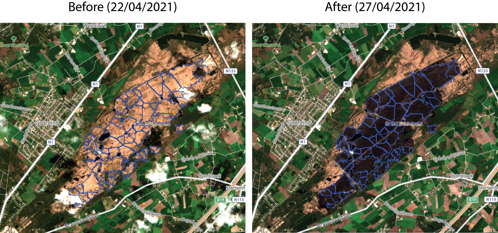

# The aftermath of nature fires using image analysis of satellite pictures

Exactly two weeks ago (April 23rd 2021) a nature fire started in the heather of 'Groot Schietveld' (Brecht, Belgium). The following three days, firefighters from different Belgian regions together with Dutch helicopters, tried to stop the fire from spreading. As part of the volunteer fire brigade of Westmalle (Zone Rand) I was part of this great collaboration. Being a volunteer firefighter means that I have another main job as data scientist. Combining both passions resulted in this image analysis to estimate the burned area.

## Satellite images

As part of the European Copernicus programme (ESA), the [**Sentinel-2**](http://www.esa.int/Applications/Observing_the_Earth/Copernicus/Sentinel-2) satellites provide systematic optical images of 10-meter spatial resolution. These open-source images are made easily accessible on the [**Terrascope**](https://terrascope.be/en) (VITO) platform. Using the interactive viewer you can scan quickly through all available satellite images of the entire Copernicus programme. When selecting the satellite images from 22/04/2021, before the disaster, and 27/04/202, after all smoke has cleared, you see the size of the disaster.

## Image analysis using FIJI (ImageJ)

By comparing both satellite images before and after the nature fire, the charred area caused by the nature fire can be estimated. The different regions of interest were calculated using the following method:

1.  Substracting the before and after image to isolate the charred region.
2.  Split the combined images into the different channels (red, green, blue).
3.  Subtract the blue from the red channel to minimize the influence of the clouds present in the before satellite image.
4.  Detecting the region of interest without introducing noise by setting a threshold.
5.  Performing a watershed to isolate the different patches of charred land.
6.  Analyzing the particles and rescaling them.

As you can see in the after picture, most of the charred area is selected without adding marches to the region of interest. By subtracting the before and after images these different black spots were excluded from the analysis. Through this image analysis, the estimated area with heather vegetation loss is 486.86 hectares.

## Validation of the results

As this was a very large nature fire (to Belgian standards) it was widely covered in the Belgian media. Different sources estimated the damage from 500 ha to over 700 ha in lost vegetation. The Flemish department of nature and forestry (Vlaams Agentschap voor Natuur en Bos) logged the total charred area with field measures using GPS coordinates. They estimated that [**570 ha**](https://www.vrt.be/vrtnws/nl/2021/04/26/nog-niet-duidelijk-hoeveel-hectare-natuurgebied-is-verwoest-in-b/) of heather and forest vegetation was consumed by the fire.

The calculated 486.86 ha from the satellite images comparison seems to underestimate the actual vegetation loss by 15%. The heather vegetation can be easy detected on the satellite images by their white-brown colour signature. The distinction between the dark green pine forest and charred pine forest is much harder to detect. This difficult separation can explain the underestimation of the calculated vegetation loss compared to the 570ha of actual measured lost vegetation.

The full analysis can be consulted on my Github page: [**https://github.com/dbaets**](https://github.com/dbaets).
